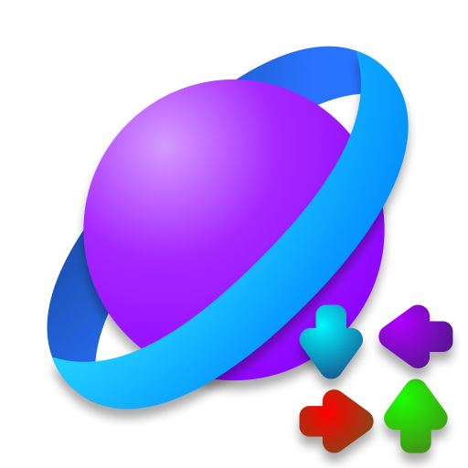

# Solar+ Engine
Its a Solar Engine Fork

# V0.0.4:

- Hold Cover now work like Note Splash, i mean : name anim + color, or name anim only

*examples:*

**w/ Color**:

```txt
holdCover red0000
holdCoverEnd red0000
hold red0000
end red0000
```
*or*

**w/ out Color**:

```txt
holdCover0000
holdCoverEnd0000
hold0000
end0000
```

- Fix Quant-Based 🗣🔥 doesn't work when bpm changed in mid song
- Add Speech Bubble Dark (Dialogue) its work when Dark mode is on


# V0.0.3:

- Add 2 checkboxes to the Note Splash Debug & Hold Cover Debug to Allow RGB or Pixel.
- Add a SCALE 🗣🔥 to the Note Splash Debug & Hold Cover Debug 

*examples:*

1- noteSplashes.txt:
```txt
note splash
22 26
0 0
0 0
0 0
0 0
0 0
0 0
0 0
0 0
1 <--- Scale
true <--- Allow RGB
true <--- Allow Pixel
```
2- holdCover.txt
```txt
hold
end
24 24
110 100
110 100
110 100
110 100
110 100
110 100
110 100
110 100
1 <--- Scale
true <--- Allow RGB
true <--- Allow Pixel
```
- Change UI Style in Note Splash Debug & Hold Cover Debug


- Add Note Color Style ['Normal', 'Quant-Based', 'Grayscale'] *Default : Normal*

# V0.0.2 - HOTFIX:

- Fix Hold Cover disappears and doesn't come back until the next note in Paused the game

# V0.0.2:

- Hold Cover Debug is now supported
- Add new `holdCoverInputText` in Chart Editor *Default : `holdCover/holdCover`*
- Add Jack Amount in Gameplay Changers
- Fix Version 0.6.1 to 0.0.2 *uhh idk why im forget about that Xd*

# V0.0.1:
- Note Splash Debug is now supported
- Add New MusicPlayer in FreePlay
- Fix Note Splash Order with out my script
- Add new option: Note Splash Opacity
- Remove option: Note Splashes *DON'T ASK*
- Add New HoldCover Support RGB + Pixel
- Add BotPlay in Chart Editor PlayState (Press 6 to Enable BotPlay)
- Add Note Splashes + HoldCover in Chart Editor PlayState
- Fix Note Color in Pixel Stages
- Fix Pixel Note RGB doesn't off in Strums `"disableNoteRGB": true,`

<details>
  <summary><h2>OG Solar Engine Credits and Stuff</h2></summary>
  
> [!NOTE]
> This readme is taken from a yet to be released version of Solar Engine! I just really hate the original old readme lmao
>
> Currently there is only one Maintaner of this repository, [CharGoldenYT](https://github.com/CharGoldenYT), as such there is likely to be a delay in respone times to Issues.
<div align="center"> 
   <br>

  <h3>
    
    Solar engine - Formerly yet another <a href="https://github.com/ShadowMario/FNF-PsychEngine">Psych Engine</a> fork.
  </h3>
  
  <p>
    <a href="https://discord.gg/RaHmP5fgyA">
      Join The OFFICIAL Solar Engine Discord Server!
    </a> <br>
    <a href="https://solarengine.net">
      Check out the Solar Engine Website!
    </a>
  </p>
</div>


---

<h3> ❓ What is Solar Engine? </h3> <!-- its an engine of the Solar System.. idk man. -->
<p>
  Solar Engine is an engine built off of Funkin' 0.2.8 with additional useful features. <br>
  Such as:
  <ul>
    <li> Modcharting Tool </li>
    <li> Customizability </li>
    <li> Easier Modding (hopefully) </li>
    <li> HScript </li>
    <li> Custom HScript States </li>
    <li> Cleaner UI </li>
  </ul>
</p>

---

<h3> 🎯 What we aim for: </h3>
<p>
  Cross platform for
  <ul>
    <li> 🐧 Linux </li>
    <li> 🪟 Windows </li>
    <li> 🍎 MacOS </li>
  </ul>

  Performance for low-end devices (Hopefully on their way!)
  
  Provide the modders an easier way to mod. <br>
  And give the players more customization.
</p>

---

<h3> 👑 Who created and helped this engine? </h3>
<table align="center">
  <tr>
    <th>Contributor Names</th>
    <th>  Daveberry   </th>
    <th>  VideoBot </th>
    <th>  BaranMuzu </th>
    <th>  CharGoldenYT </th>
  </tr>

  <tr>
    <th>Initial Role</th>
    <th> Created the engine. </th>
    <th> Created the engine. </th>
    <th> Invited to help. </th>
    <th> Invited to help. </th>
  </tr>

  <tr>
    <th>Role</th>
    <th> Former Developer </th>
    <th> Lead Developer </th>
    <th> Former Developer </th>
    <th> Basically Lead Coder </th>
  </tr>

  <tr>
    <th> Personal Message </th>
    <th> "I'M NOT FUCKING GAY" </th>
    <th> "I love MODCHARTING" </th>
    <th> "idk" </th>
    <th> "guys I swear VS Char is coming in 2040." </th>
  </tr>
</table>

---

<h3> 🫵❓ How could YOU help? </h3>
<p>
  You can either:
  <ul>
    <li> Submit Issues with the engine </li>
    <li> Submit Pull Requests (Bugs, QOL, etc...) </li>
  </ul>
</p>

<h3> ☝️❓ How can YOU join the Developer team? </h3>
<p>
  We are currently not hiring and probably never. <br>
  We only invite people to join the Developer team.
</p>


